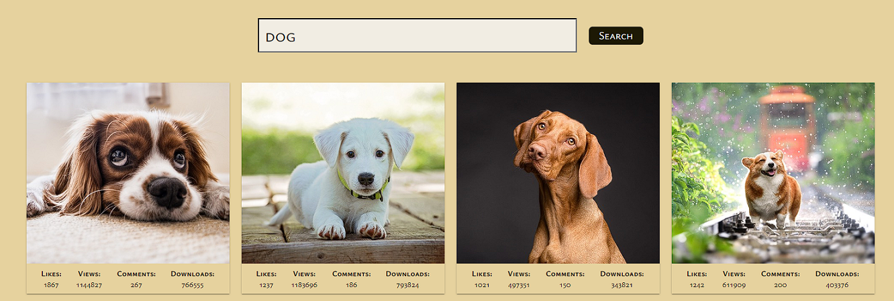
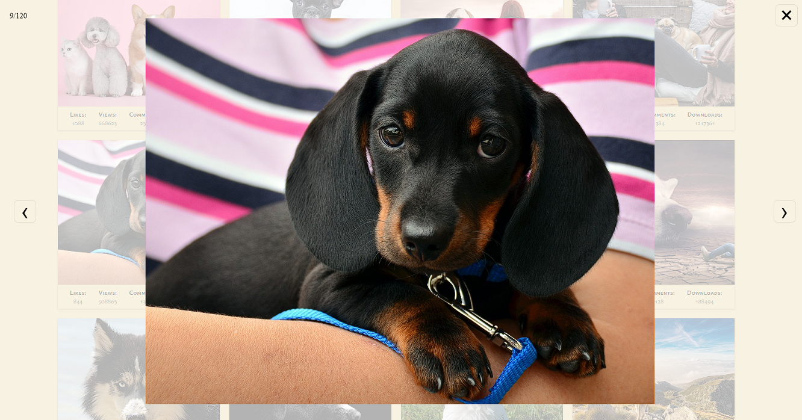

# Image Search App

A  JavaScript web application for searching and browsing images fetched asynchronously from an external REST API.

## Technologies Used
* HTML
* CSS
* JavaScript
* Axios 
* SimpleLightbox
* Notiflix 

## Key Features
* **Image Search:** Asynchronous REST API requests using Axios based on user queries.
   
* **SimpleLightbox Gallery:** Interactive modal gallery for viewing full-size images with navigation control.
   
* **Pagination & Smooth Scroll:** Fetching subsequent result pages with a smooth scrolling effect applied when loading new image batches.
* **UI Notifications & Error Handling:** Toast alerts via Notiflix displaying result counts, empty search warnings, or end-of-collection notices.

## Setup
To run this project, install it locally using npm:

```
npm i
npm start
```
